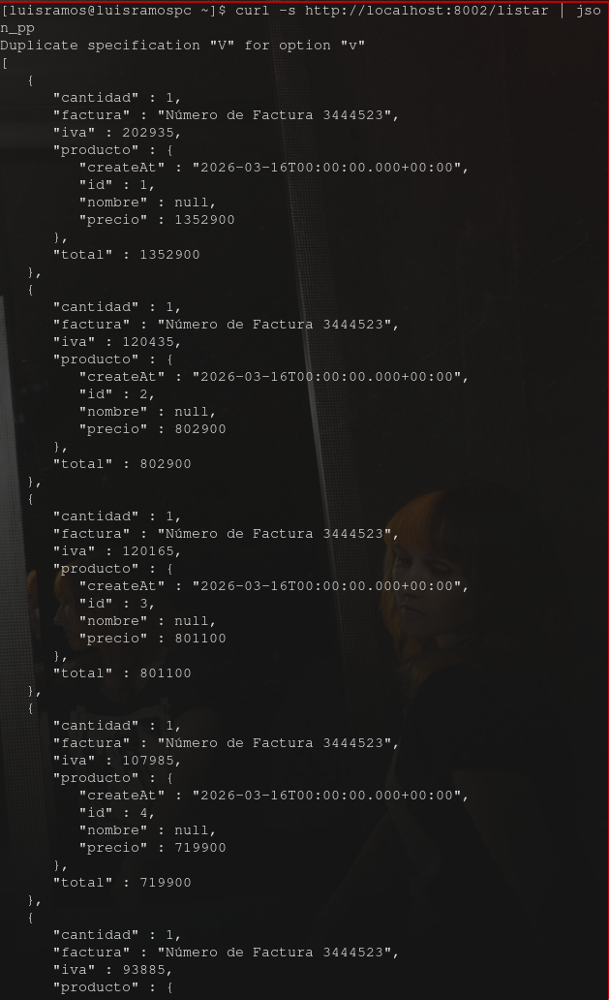
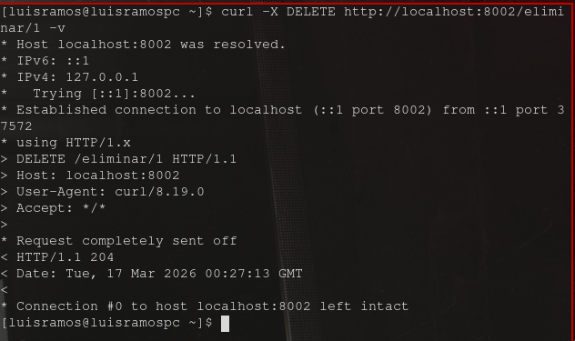
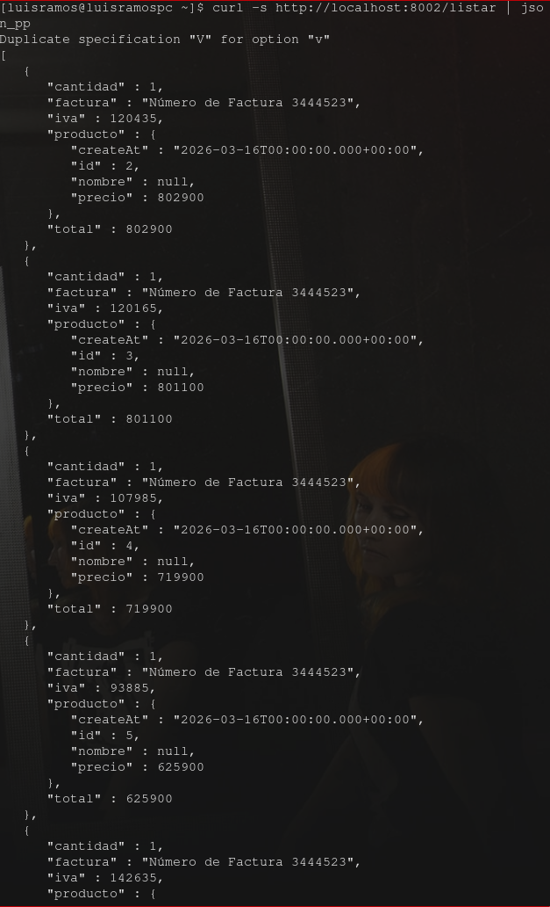
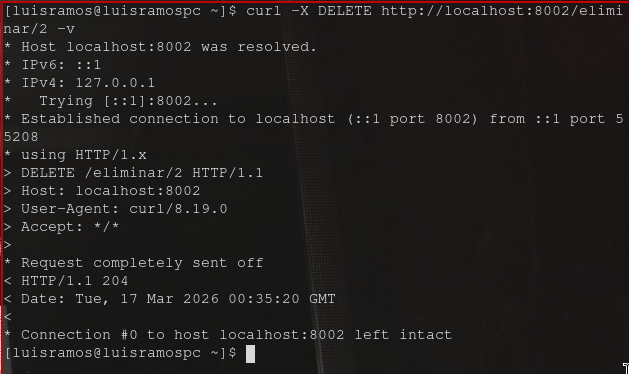

# Tarea 2 - Computación en la Nube

**Materia:** Seminario de Ciencias de la Computación B (Computación en la Nube)  
**Profesor:** Gustavo Márquez Flores  

## Integrantes del Equipo
* Luis Mario Solares Ramos
* Erick Luis Juarez

## Descripción del Proyecto
En este proyecto implementamos dos microservicios en Spring Boot para gestionar un vehículos (GMC, Ford, Toyota), usando como forma de las APIs **RestTemplate** y **Feign**. 

Se implemento lo siguiente:
1. `springboot-servicio-productos` (Puerto 8001): Gestiona la base de datos de modelos de autos. Se agregó la operación HTTP `DELETE` para eliminar un vehículo.
2. `springboot-servicio-item` (Puerto 8002): Servicio de productos. Se agregó la operación HTTP `DELETE` utilizando RestTemplate y Feign.

## Instrucciones de Ejecución

Para correr el proyecto localmente, es necesario levantar ambos microservicios en el orden correcto. Primero hay que asegurarse de tener instalado Java y Maven.

### 1. Levantar el Servicio de Productos
Abrir una terminal, moverse al directorio del primer microservicio y ejecutar:
```bash
cd springboot-servicio-productos
mvn spring-boot:run
```
El servicio se iniciará en http://localhost:8001

### Levantar el Servicio de items
Abrir una terminal, moverse al directorio del segundo microservicio y ejecutar:
```bash
cd springboot-servicio-item
mvn spring-boot:run
```
El servicio se iniciará en http://localhost:8002

### Evidencia de Corridas (Pruebas de Eliminación)
A continuación se muestran las pruebas de ejecución probando la eliminación de un producto y un item.

## Corrida 1: Eliminación utilizando RestTemplate



## Corrida 2: Eliminación utilizando Feign


